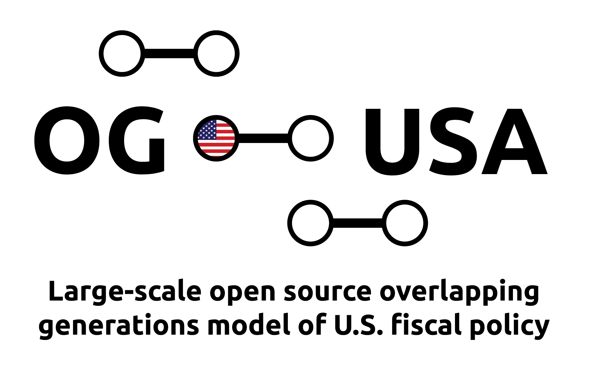

 

 ------

 

 ------

In this PSL Demo Day, I demonstrate how to use the open source [`OG-USA`](https://github.com/PSLmodels/OG-USA) macroeconomic model of U.S. fiscal policy. [Jason DeBacker](https://www.jasondebacker.com/) and I ([Richard Evans](https://sites.google.com/site/rickecon/)) have been the core maintainers of this project and repository for the last six years. This demo is organized into the following sections.

* [A brief note about value of the PSL community](#brief-note-about-the-value-of-the-PSL-community)
* [Description of the OG-USA model](#description-of-og-usa-model)
* [Using OG-USA on Compute Studio](#using-og-usa-on-compute-studio)

## Brief note about the value of the PSL community

The Policy Simulation Library is a decentralized organization of open source policy models. The [Policy Simulation Library GitHub organization](https://github.com/PSLmodels) houses many open source repositories, each of which represents a curated policy project by a diverse group of maintainers. The projects that have met the highest standards of best practices and documentation are designated as `psl-cataloged`, while newer projects that are in earlier stages are designated as `psl-incubating`. The philosophy and goal of the PSL environment is to make policy modeling open and transparent. It also allows more collaboration and cross-project contributions and interactions.

The Policy Simulation Library group has been holding these PSL Demo Day webinars since the end of 2020. The video of each webinar is available on the [Policy Simulation Library YouTube channel](https://www.youtube.com/channel/UCf7WWCuZHs_FFLjuBW4a4_Q). These videos are a great resource for learning the different models available in the PSL community, how the models interact, how to contribute to them, and what is on the horizon in their development. Also excellent in many of the PSL Demo Day webinars is a demonstration of how to use the models on the [Compute Studio](https://about.compute.studio/) web application platform.

I have been a participant in and contributor to the PSL community since its inception. I love economic policy modeling. And I learned how sophisticated and complicated economic policy models can be. And any simulation can have hundreds of underlying assumptions, some of which may not be explicitly transparent. I think models that are used for public policy analysis have a philosophical imperative to be open source. This allows others to verify results and test sensitivity to assumptions.

Another strong benefit of open source modeling is that it is fundamentally apolitical. With proprietary closed-source policy models, an outside observer might criticize the results of the model based on the perceived political biases of the modeler or the sponsoring organization. With open-source models, a critic can be redirected to the underlying assumptions, structure, and content of the model. This is constructive criticism and debate that moves the science foreward. In the current polarized political environment in the U.S., open-source modeling can provide a constructive route for bipartisan cooperation and the democratization of computational modeling. Furthermore, open-source modeling and workflow encourages the widest forms of collaboration and contributions.

## Description of OG-USA model

[`OG-USA`](https://github.com/PSLmodels/OG-USA) is an open-source overlapping generations, dynamic general equilibrium, heterogeneous agent, macroeconomic model of U.S. fiscal policy. The GitHub repository for the `OG-USA` source code is [github.com/PSLmodels/OG-USA](https://github.com/PSLmodels/OG-USA). This repository contains all the source code and instructions for loading and running `OG-USA` and all of its dependencies on your local machine. We will probably do another PSL Demo Day on how to run `OG-USA` locally. This Demo Day webinar is about running `OG-USA` on the [Compute Studio web application](https://compute.studio/PSLmodels/OG-USA/). See Section "[Using OG-USA on Compute.Studio](#using-og-usa-on-compute-studio)" below.

As a heterogeneous agent macroeconomic model, `OG-USA` allows for distributional analyses at the individual and firm level. That is, you can simulate the model and answer questions like, "How will an increase in the top three personal income tax rates affect people of different ages and income levels?" Microsimulation models can answer these types of distributional analysis questions as well. However, the difference between a macroeconomic model and a microsimulation model is that the macroeconomic models can simulate how each of those individuals and firms will respond to a policy change (e.g., lower labor supply or increased investment demand) and how those behavioral responses will add up and feed back into the macroeconomy (e.g., the effect on GDP, government revenue, government debt, interest rates, and wages).

`OG-USA` is a large-scale model and comprises tens of thousands of lines of code. The status of all of this code being publicly available on the internet with all collaboration and updates also public makes this an open source project. However, it is not enough to simply post one's code. We have gone to great lengths to make in-line comments or "docstring" in the code to clarify the purpose of each function and line of code. For example, look in the [`OG-USA/ogusa/household.py`](https://github.com/PSLmodels/OG-USA/blob/master/ogusa/household.py) module. The first function on [line 18](https://github.com/PSLmodels/OG-USA/blob/master/ogusa/household.py#L18) is the `marg_ut_cons()` function. As is described in its docstring, its purpose is to "Compute the marginal utility of consumption."

These in-code docstrings are not enough. We have also created textbook style OG-USA documentation at [pslmodels.github.io/OG-USA/](https://pslmodels.github.io/OG-USA/) using the [Jupyter Book](https://jupyterbook.org/) medium. This form of documentation has the advantage of being in book form and available online. It allows us to update the documentation in the open-source repository so changes and versions can be tracked. It describes the [`OG-USA` API](https://pslmodels.github.io/OG-USA/content/api/public_api.html), [`OG-USA` theory](https://pslmodels.github.io/OG-USA/content/theory/intro.html), and [`OG-USA calibration](https://pslmodels.github.io/OG-USA/content/calibration/exogenous_parameters.html). As with the model, this documentation is always a work in progress. But being open-source allows outside contributors to help with its updated and error checking.

One particular strength of the `OG-USA` model I want to highlight is its interaction with microsimulation models to incorporate information about tax incentives faced by the heterogeneous households in the model. We have interfaced `OG-USA` with microsimulation models in India and in the European Commission. `OG-USA`'s default for modeling the United States is to use the open-source `Tax-Calculator` microsimulation model, which was described by Anderson Frailey in the [last Demo Day of 2020](http://blog.pslmodels.org/demo-day-4-taxbrain). However, DeBacker and I currently have a project in which we use `OG-USA` to simulate policies using the Tax Policy Center's microsimulation model. The way `OG-USA` interfaces with microsimulation models to incorporate rich tax data is described in the documentation in the calibration chapter entitled, "[Tax Functions](https://pslmodels.github.io/OG-USA/content/calibration/tax_functions.html)".

## Using OG-USA on Compute Studio

In the demonstration, I focus on how to run experiments and simulations with `OG-USA` using the [Compute Studio](https://compute.studio/PSLmodels/OG-USA/) web application platform rather than installing running the model on your local machine. To use `OG-USA` on this web application, you will need a [Compute Studio account](https://compute.studio/users/signup/). Once you have an account, you can start running any model available through the site. For some models, you will have to pay for the compute time, although the cost of running these models is very modest. However, all Compute Studio simulations of the `OG-USA` model are currently sponsored by the [Open Source Economics Laboratory](https://www.oselab.org/). This subsidy will probably run out in the next year. But we are always looking for funding for these models.

Once you are signed up and logged in to your Compute Studio account, you can go to the `OG-USA` model on Compute Studio at [compute.studio/PSLmodels/OG-USA](https://compute.studio/PSLmodels/OG-USA/). The experiment that we simulated in the demonstration is available at [compute.studio/PSLmodels/OG-USA/206](https://compute.studio/PSLmodels/OG-USA/206/). The description at the top of the simulation page describes the changes we made. You can look through the input page by clicking on the "Inputs" tab. We ran the model by clicking the green "Run" button at the lower left of the page. The model took about 5 hours to run, so I pre-computed the results that we discussed in the demo. The outputs of the experiment are available in the "Outputs" tab on the page. I also demonstrated how one can click the "Download Results" button at the bottom of the "Outputs" tab to download more results from the simulation. However, the full set of results is only available by installing and running the `OG-USA` model simulation on your local machine.

The benefits of the Compute Studio web application are that running the `OG-USA` model is much easier for the non-expert, and the multiple-hour computation time can be completed on a remote machine in the cloud.

## Resources

* [`OG-USA` on Compute Studio](https://compute.studio/PSLmodels/OG-USA/)
* [Simulation from the demonstration](https://compute.studio/PSLmodels/OG-USA/206/)
* [`OG-USA` GitHub repo](https://github.com/PSLmodels/OG-USA)
* [`OG-USA` documentation](https://pslmodels.github.io/OG-USA/)
* [`Tax-Calculator` GitHub repo](https://github.com/PSLmodels/Tax-Calculator)
