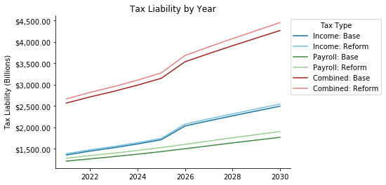

The TaxBrain project was primarily created to serve as the backend of the
[Tax-Brain web-application](https://www.compute.studio/PSLmodels/Tax-Brain/).
But at its core, TaxBrain is a Python package that greatly simplifies tax policy
analysis. For this PSL Demo-Day, I demonstrated TaxBrain's capabilities as a
standalone package, and how to use these to produce high-level summaries of the
revenue impacts of proposed tax policies. The Jupyter Notebook from the presentation
can be found [here]().

TaxBrain's Python API allows you to conduct a full analysis of income tax policies
in just three lines of code:

```python
from taxbrain import TaxBrain

tb = TaxBrain(START_YEAR, END_YEAR, use_cps=True, reform=REFORM_POLICY)
tb.run()
```

Where `START_YEAR` and `END_YEAR` and the first and last years, respectively,
of the analysis; `use_cps` is a simple boolean indicator that you want to use
The CPS-based microdata file prepared for use with Tax-Calculator; and `REFORM_POLICY`
is either a JSON file or Python dictionary that specifies a reform suitable for
Tax-Calculator. The forthcoming release of TaxBrain will also include a feature
that allows you to perform a stacked revenue analysis as well. The inspiration
for this feature was presented by Jason DeBacker in a [previous demo-day](http://blog.pslmodels.org/demo-day-11-stacked-revenue-estimates).

Once TaxBrain has been run, there are a number of methods and functions included
in the package to create tables and plots to summarize the results. I used the
[Biden 2020 campaign proposal](https://github.com/PSLmodels/examples/blob/main/psl_examples/taxcalc/Biden2020.json)
in the demo, and the resulting figures are below. The first is a "volcano
plot" that makes it easy to see the magnitude of the change in tax liability
individuals across the income distribution face. Each dot represents a tax unit,
and the x and y variables can be customized based on the user's needs.


The second gives a higher-level look at how taxes change in each income bin. It
breaks down what percentage of each income bin faces a tax increase or decrease,
and the size of that change.



The final plot shown in the demo simply shows tax liabilities by year over the
budget window.


The last feature I showed was TaxBrain's automated reports. TaxBrain uses the
results of the simulation to determine what income groups are most affected by the
specified reform, 

Resources:
* [Tax-Brain GitHub repo](https://github.com/PSLmodels/Tax-Brain)
* [Tax-Brain Documentation](http://taxbrain.pslmodels.org/content/intro.html)