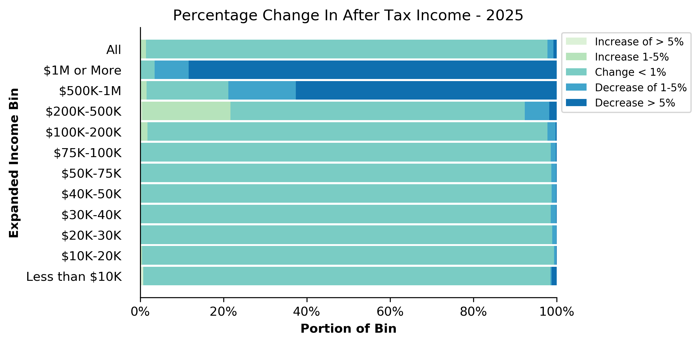
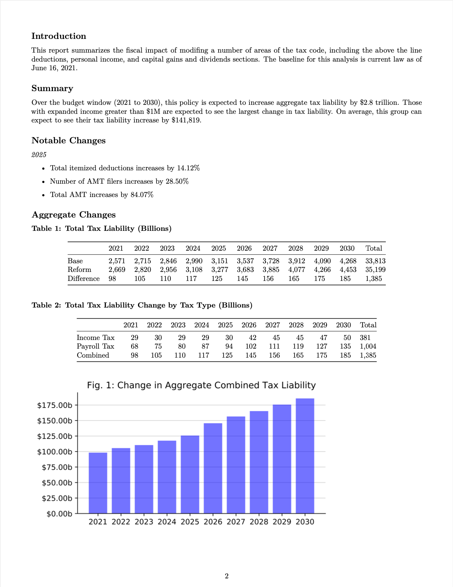
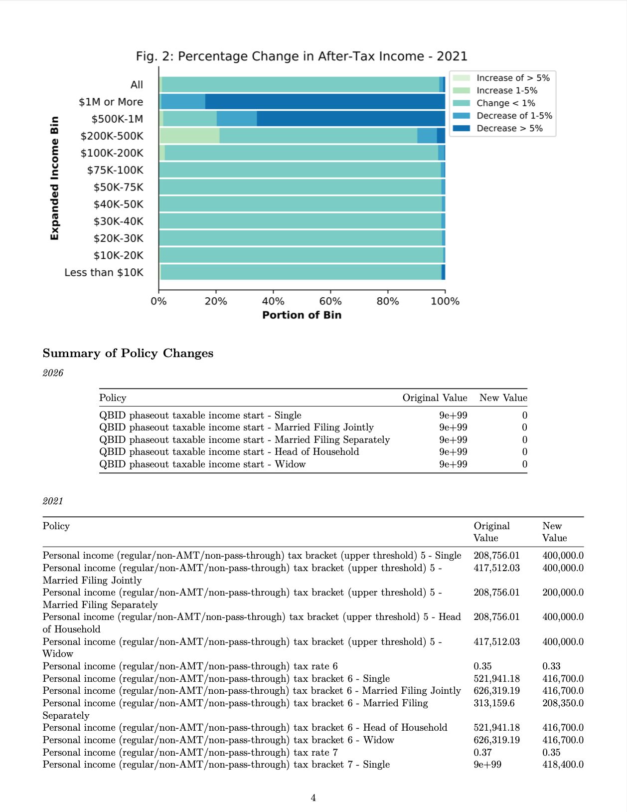
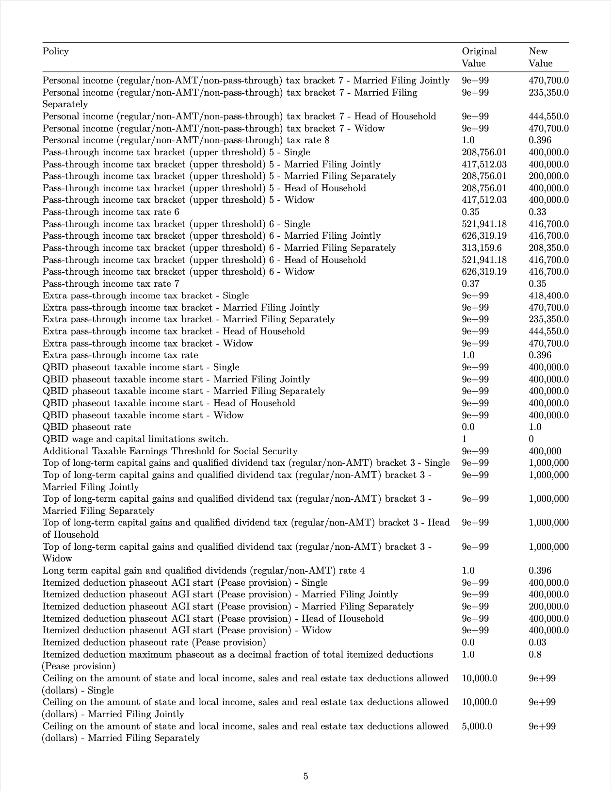
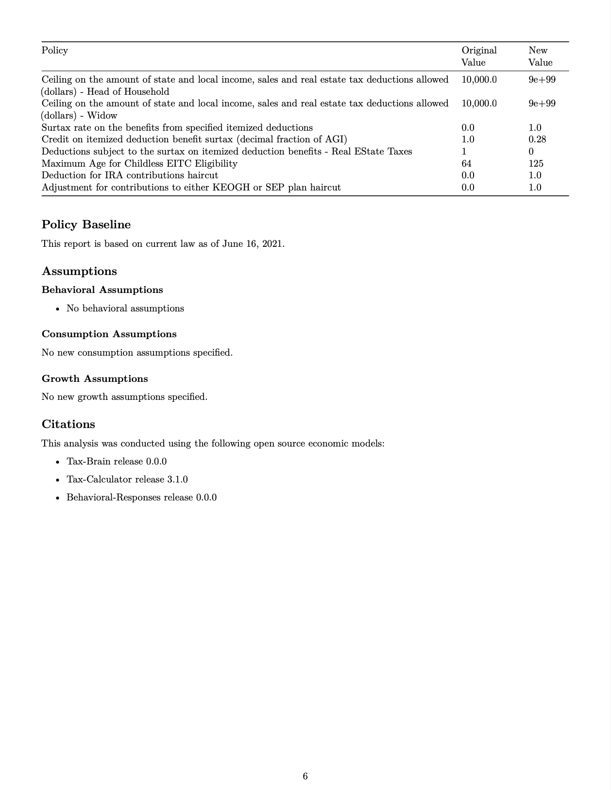

------



------

The TaxBrain project was primarily created to serve as the backend of the [Tax-Brain web-application](https://www.compute.studio/PSLmodels/Tax-Brain/).
But at its core, TaxBrain is a Python package that greatly simplifies tax policy analysis.
For this PSL Demo-Day, I demonstrated TaxBrain's capabilities as a standalone package, and how to use it to produce high-level summaries of the revenue impacts of proposed tax policies.
The Jupyter Notebook from the presentation can be found [here](https://gist.github.com/andersonfrailey/bb8ac6db609bf0146ef23d1d35d32334).

TaxBrain's Python API allows you to run a full analysis of income tax policies in just three lines of code:

```python
from taxbrain import TaxBrain

tb = TaxBrain(START_YEAR, END_YEAR, use_cps=True, reform=REFORM_POLICY)
tb.run()
```

Where `START_YEAR` and `END_YEAR` are the first and last years, respectively, of the analysis; `use_cps` is a boolean indicator that you want to use the CPS-based microdata file prepared for use with Tax-Calculator; and `REFORM_POLICY` is either a JSON file or Python dictionary that specifies a reform suitable for Tax-Calculator.
The forthcoming release of TaxBrain will also include a feature that allows you to perform a stacked revenue analysis as well.
The inspiration for this feature was presented by Jason DeBacker in a [previous demo-day](http://blog.pslmodels.org/demo-day-11-stacked-revenue-estimates).

Once TaxBrain has been run, there are a number of methods and functions included in the package to create tables and plots to summarize the results.
I used the [Biden 2020 campaign proposal](https://github.com/PSLmodels/examples/blob/main/psl_examples/taxcalc/Biden2020.json) in the demo and the resulting figures are below.
The first is a "volcano plot" that makes it easy to see the magnitude of the change in tax liability individuals across the income distribution face.
Each dot represents a tax unit, and the x and y variables can be customized based on the user's needs.


The second gives a higher-level look at how taxes change in each income bin.
It breaks down what percentage of each income bin faces a tax increase or decrease, and the size of that change.



The final plot shown in the demo simply shows tax liabilities by year over the budget window.


The last feature I showed was TaxBrain's automated reports. 
TaxBrain uses saved results and an included report template to write a report summarizing the findings of your simulation.
The reports include tables and figures similar to what you may find in similar write ups by the Joint Committee on Taxation or Tax Policy Center including a summary of significant changes caused by the reform, and all you need is one line of code:

```python
report(tb, name='Biden Proposal', outdir='biden', author='Anderson Frailey')
```

The above code will save a PDF copy of the report in a directory called `biden` along with PNG files for each of the graphs created and the raw Markdown text used for the report, which you can then edit as needed if you would like to add content to the report that is not already included.
Screenshots of the default report are included below.







There are of course downsides to using TaxBrain instead of Tax-Calculator directly.
Specifically, it's more difficult, and sometimes impossible, to perform custom  tasks like modeling a feature of the tax code that hasn't been added to Tax-Calculator yet or advanced work with marginal tax rates.
But for day-to-day tax modeling, the TaxBrain Python package can significantly simply any workflow.

Resources:
* [Tax-Brain GitHub repo](https://github.com/PSLmodels/Tax-Brain)
* [Tax-Brain Documentation](http://taxbrain.pslmodels.org/content/intro.html)
