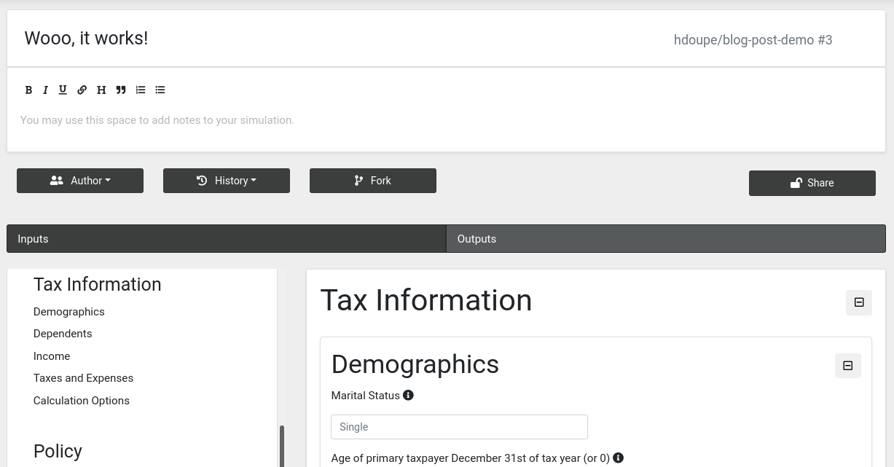

------



------

Compute Studio (C/S) is a platform for publishing and sharing computational models and data visualizations. In this demo day, I show how to publish your own project on C/S using the new automated deployments feature. You can find an in depth guide to publishing on C/S
in the [developer docs](https://docs.compute.studio/publish/guide.html).

C/S supports two types of projects: models and data visualizations. Models are fed some inputs and return a result. Data visualizations are web servers  backed by popular open-source libraries like Bokeh, Dash, or Streamlit. Models are good for long-running processes and producing archivable results that can be shared and returned to easily. Data visualizations are good for highly interactive and custom user experiences.

Now that you've checked out the [developer docs](https://docs.compute.studio/publish/guide.html) and set up your model or data-viz, you can head over to the C/S publishing page [https://compute.studio/new/](https://compute.studio/new/) to publish your project. Note that this page is still very much under construction and may look different in a few weeks.

Next, you will be sent to the second stage in the publish flow where you will provide more details on how to connect your project on C/S:

Clicking "Connect App" will take you to the project home page:

Go to the "Settings" button in the top-right corner and this will take you to the project dashboard where you can modify everything from the social preview of your project to the amount of compute resources it needs:

The "Builds" link in the sidebar will take you to the builds dashboard where you can create your first build:

It's time to create the first build. You can do so by clicking "New Build". This will take you to the build status page. While the build is being scheduled, the page will look like this:

You can click the "Build History" link and it will show that the build has been started:

The build status page should be updated at this point and will look something like this:

C/S automated deployments are built on top of [Github Actions](https://github.com/features/actions). Unfortunately, the logs in Github Actions are not available through the Github API until after the workflow is completely finished. The build status dashboard will update as the build progresses and once it's done, you will have full access to the logs from the build. These will contain outputs from installing your project and the outputs from your project's tests.

In this case, the build failed. We can inspect the logs to see that an import error caused the failure:

I pushed an update to my fork of Tax-Cruncher on Github and restarted the build by clicking "Failure. Start new Build". The next build succeeded and we can click "Release" to publish the project:

The builds dashboard now shows the two builds:

Finally, let's go run our new model:

It may take a few seconds for the page to load. This is because the model code and all of its dependencies are being loaded onto the C/S servers for the first time:

The steps for publishing a data visualization are very similar. The main idea is that you tell C/S what Python file your app lives in and C/S will know how to run it given your data visualization technology choice.
