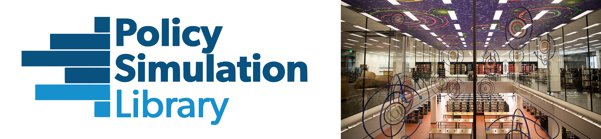

------

The [Policy Simulation Library](https://pslmodels.org/) is hosting a workshop in Washington, DC on March 25 on open source tools for the analysis of tax policy. Participants will learn how to use open source models from the Library for revenue estimation, distributional analysis, and to simulate economic impacts of tax policy. The workshop is intended to be a hands-on experience and participants can expect to leave with the required software, documentation, and knowledge to continue using these tools. All models in the workshop are written in the Python programming language--familiarity with the language is helpful, but not required.

**Workshop Schedule:**
* **8:15-8:45a:** Breakfast
* **8:45-9:00a:** Introduction
* **9:00-9:50a:** Using [**Tax-Calculator**](https://taxcalc.pslmodels.org/) for revenue estimation and distributional analysis ([Matt Jensen](https://www.aei.org/profile/matthew-h-jensen/))
* **10:00-10:50a:** Estimating effective tax rates on investment with [**Cost-of-Capital-Calculator**](https://ccc.pslmodels.org/) ([Jason DeBacker](https://jasondebacker.com/))
* **11:00-11:50a:** Macroeconomic modeling of fiscal policy with [**OG-Core**](https://pslmodels.github.io/OG-Core/) and [**OG-USA**](https://pslmodels.github.io/OG-USA/) ([Richard W. Evans](https://sites.google.com/site/rickecon))
* **noon-1:00p:** Lunch and demonstration of [**PolicyEngine**](https://policyengine.org/) ([Max Ghenis](https://www.ubicenter.org/author/max/))

The workshop will be held at the Martin Luther King Jr. Memorial Library in Washington, DC. Participants are expected to arrive by 8:30am and the program will conclude at 1:00pm. Breakfast and lunch will be provided. [PSL Foundation](https://psl-foundation.org/) is sponsoring the event and there is no cost to attend. Attendance is limited to 30 in order to make this a dynamic and interactive workshop.

To register, please use [this Google Form](https://docs.google.com/forms/d/e/1FAIpQLSewWIdF7r7BIEPRDjq_AWE6yJMx9fHwIxCwyg58D52lNMFqiA/viewform). Registration will close March 11. Participants will be expected to bring a laptop to the workshop where they can interact with the software in real time with the instructors. Registered participants will receive an email before the event with a list of software to install before the workshop.

Please feel free to share this invitation with your colleagues.

Questions about the workshop can be directed to Jason DeBacker at [jason.debacker@gmail.com](mailto:jason.debacker@gmail.com).
